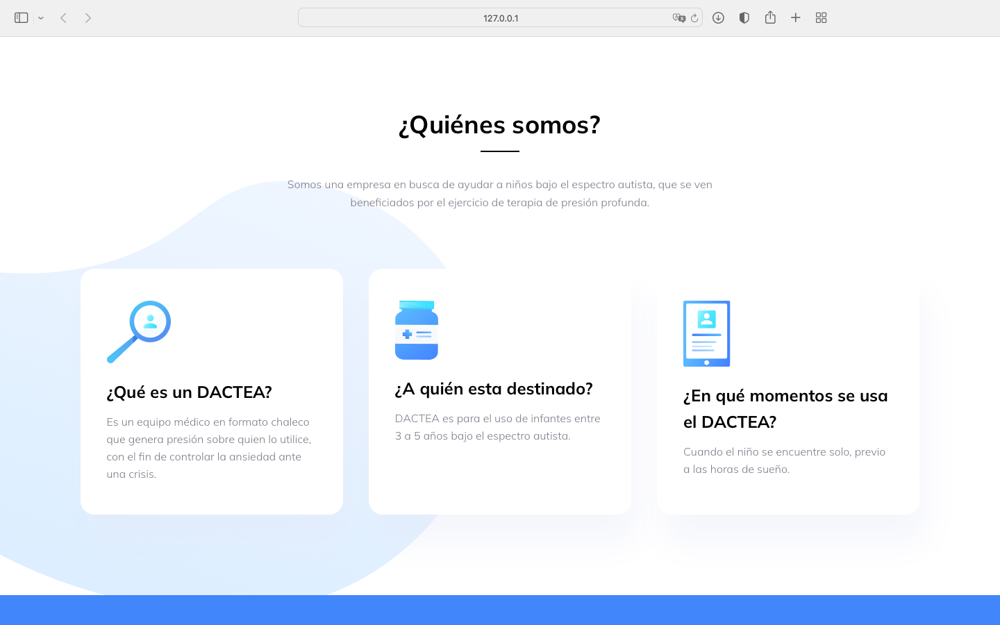
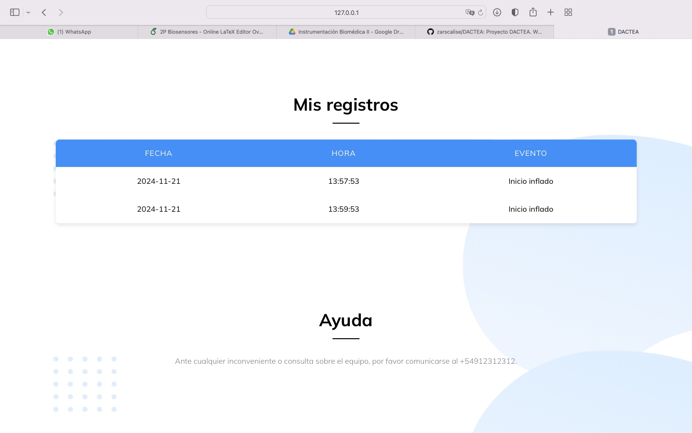
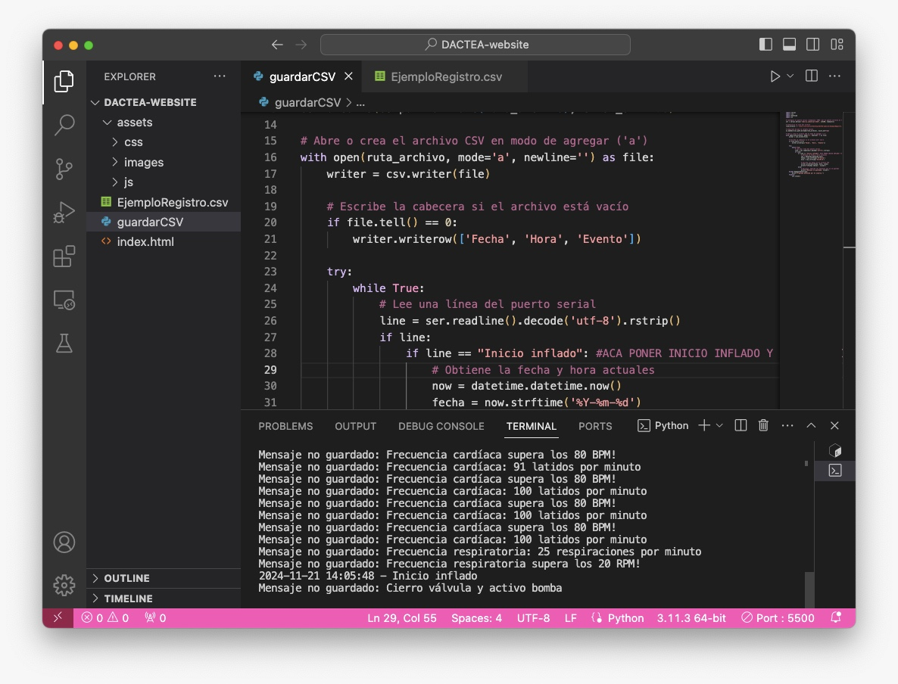
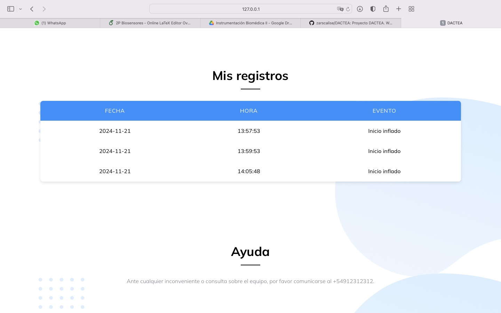

# Proyecto DACTEA

  

El proyecto consiste en la creación de un equipo médico que envía señales biomédicas a Arduino. Estas señales se registran y, según condiciones umbral, se dispara una respuesta. La activación del equipo queda registrada en un sitio web realizado con los lenguajes HTML, CSS, JS y Python.

## Pasos para ejecutar el proyecto

1. **Configurar Visual Studio Code**:
   - Descargar la extensión **Live Server**.

2. **Abrir el proyecto en Visual Studio Code**:
   - Ir a _File_ y seleccionar la opción _Open Folder_. Abrir la carpeta `DACTEA-website`.
   - Dentro de la carpeta encontrarás los siguientes archivos y directorios:
     - **index.html**: Contiene la estructura del sitio web.
     - **Carpeta assets**:
       - **css**: Archivos relacionados con la estética visual del sitio.
       - **images**: Imágenes accesorias utilizadas en el sitio.
       - **js**:
         - Scripts de funcionalidad que procesan las señales de bpm y rpm, manejan la conexión con Arduino y generan el archivo `.csv`.
     - **guardarCSV.py**: Código que crea el archivo `EjemploRegistro.csv` y carga los datos proporcionados por Arduino.

3. **Ejecutar el sitio web**:
   - A la izquierda de la barra inferior de Visual Studio Code, seleccionar _Go Live_. Esto ejecutará la página web.

4. **Cargar el código en Arduino**:
   - Correr el archivo `DACTEA-arduino.ino` en el IDE de Arduino.

5. **Ejecutar el script en Python**:
   - Correr el archivo `guardarCSV.py` en Visual Studio Code.
   - Nota: Con `Ctrl+C`, puedes interrumpir la ejecución para actualizar el archivo `EjemploRegistro.csv`. Esto permitirá visualizar los datos en la tabla del sitio web.

## Visualizaciones

### Sitio Web

### Vistas de registro

### Vista en Visual Studio Code al detectar activación

### Vistas de registro luego de activación

